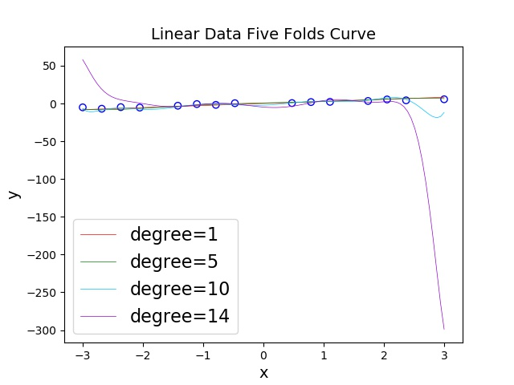
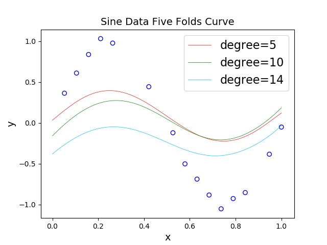
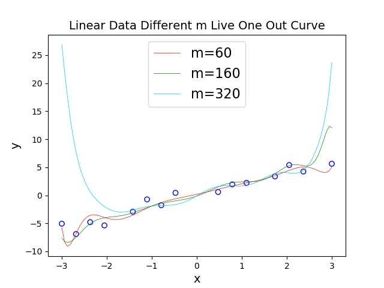
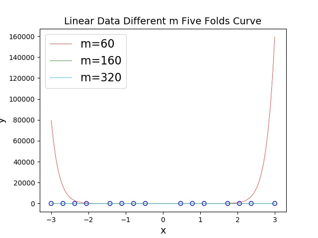
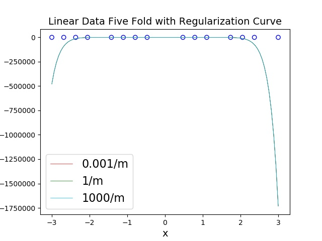

Regression
==

## Introduction

Implement linear regression (degree=1), polynomial regression (degree=5,10,14) on both linear data and trigonometric data. Test the results on different data size (m=20,60,160,320). Also adding L2 regularization lambda=0,0.001/m, 1/m, and 1000/m) see the results difference

## Requirements

```
pytorch 1.4.0
scikit-learn 0.22.1
matplotlib 3.1.3
pillow 6.2.1
```

## Setup

1. Locate to the project folder
2. Ensure all the requirements are installed in your environment
3. `python3 main.py`
4. The error of training, validation and testing will be shown on your screen
5. The fitting plots will all be saved in the folder “figure/”

## Results

**Regression on linear data with degree=1,5,10,14**

> Leave One Out

| Degree | Training Loss | Validation Loss | Testing Loss |
|--------|---------------|-----------------|--------------|
| 1      | 0.0591        | 0.696           | 0.1779       |
| 5      | 0.0538        | 1.1657          | 0.1513       |
| 10     | 0.2542        | 35.4669         | 2.9379       |
| 14     | 0.1185        | 15.1026         | 0.1128       |


> Five Fold

| Degree | Training Loss | Validation Loss | Testing Loss |
|--------|---------------|-----------------|--------------|
| 1      | 0.535         | 0.8923          | 0.2477       |
| 5      | 0.5363        | 0.9266          | 0.2648       |
| 10     | 0.5517        | 7.8812          | 2.8535       |
| 14     | 0.5611        | 9.5415          | 0.5596       |



**Regression on sine curve data with degree=5,10,14**

> Live One Out

| Degree | Training Loss | Validation Loss | Testing Loss |
|--------|---------------|-----------------|--------------|
| 5      | 0.0027        | 0.0554          | 0.0136       |
| 10     | 0.0801        | 1.1556          | 0.133        |
| 14     | 0.3034        | 4.3546          | 1.2098       |


> Five Fold

| Degree | Training Loss | Validation Loss | Testing Loss |
|--------|---------------|-----------------|--------------|
| 5      | 0.0999        | 0.1106          | 0.0628       |
| 10     | 0.323         | 0.3568          | 0.266        |
| 14     | 0.1606        | 0.7992          | 0.3423       |



**Regression on different training data size m**

> Live One Out

| m   | Training Loss | Validation Loss | Testing Loss |
|-----|---------------|-----------------|--------------|
| 60  | 0.0306        | 2.0622          | 0.0928       |
| 160 | 0.019         | 3.3542          | 0.0258       |
| 320 | 0.0464        | 1.198           | 0.0322       |



> Five Fold

| m   | Training Loss | Validation Loss | Testing Loss |
|-----|---------------|-----------------|--------------|
| 60  | 0.1279        | 0.2387          | 2139.6487    |
| 160 | 0.0205        | 0.0724          | 0.0256       |
| 320 | 0.0077        | 0.0156          | 0.0328       |



**Regression with regularization lambda=0.001/m, 1/m, 1000/m**

| lambda  | Training Loss | Validation Loss | Testing Loss |
|---------|---------------|-----------------|--------------|
| 0.001/m | 0.5578        | 9.68            | 966.1201     |
| 1/m     | 5.247         | 45.2341         | 966.3683     |
| 1000/m  | 0.821         | 255.8676        | 964.6821     |

