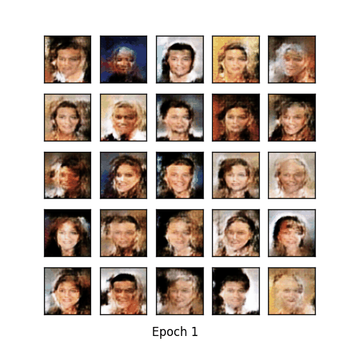

DCGAN Real Face Generation
==

## Introduction

Generating celebrity images using DCGAN

## Requirements

```
Pytorch 0.4.1
cuda80
Python 2.7.6
torchvision 0.1.8
matplotlib 1.3.1
imageio 2.2.0
scipy 0.19.1
```

## Setup

1. Create a conda environment that can fulfill the requirements above
2. Activate the environment
3. Put data into this project folder
4. First, change the path in the following files
    a. celebA_data_preprocess.py: change the path of `root` and `save_root`
    b. pytorch_CelebA_DCGAN.py: change the path of `data_dir`
5. Execute the preprocess program: `python celebA_data_preprocess.py` -> the resizing image will be saved in “resized_celebA/celebA”
6. Execute the DCGAN main program to get the generate result, weight and loss curve: `python pytorch_CelebA_DCGAN.py` -> after execution the following files will be generated in the folder “CelebA_DCGAN_results”
    a. Fixed_results: this folder will have every epoch (200) generated images
    b. discriminator_param.pkl: this file contains the weights of the trained discriminator
    c. generator_param.pkl: this file contains the weights of the trained generator
    d. generation_animation.gif: gif of all the generated images
7. Before executing add_noise.py first change the path of `MODEL_PATH` and `SAVEPATH` in the file
8. Execute add_noise.py: `python add_noise.py` -> the following files will be generated in the folder “CelebA_DCGAN_results”
    a. normal_0_1.png: generated image with normal distribution noise N(0,1)
    b. Normal_-10_1.png: generated image with normal distribution noise N(-10,1)
    c. Uniform_0_1.png: generated image with uniform distribution noise U(0,1)

## Results

### 30,000 training images


**Loss Curve**


### 200,000 training images



**Loss Curve**


